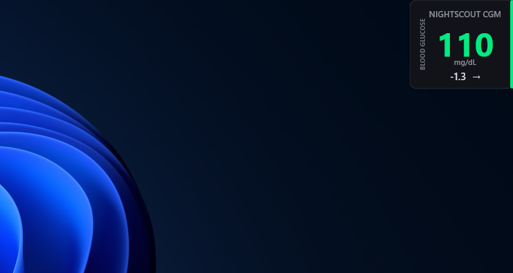
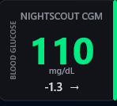

# Nightscout CGM Desktop Monitor 🩸

 

---

## 🇬🇧 ENGLISH

An ultra-minimalist, cyber-style top-right HUD blood glucose monitor for **Nightscout** users, built with **Rainmeter**. Designed to blend seamlessly into your monitor's frame like a futuristic telemetry LED bar.

### ✨ Features
* **Top-Right HUD Ergonomics:** Specifically designed to sit flush against the top-right border of your monitor without blocking active workspace.
* **Dynamic Alert LED Bar:** The left vertical accent bar dynamically changes color based on your real-time glucose levels (Blue for Hypo, Green for In-Range, Yellow/Red for Hyper).
* **Universal Trend Arrows:** Displays clean, modern directional trend arrows (`↑`, `↗`, `→`, `↘`, `↓`, `⇊`) alongside real-time delta changes.
* **Zero-Cloud Telemetry:** Direct communication between your local PC and your personal Nightscout API. No third-party tracking or data collection.
* **#WeAreNotWaiting:** Built by and for the open-source diabetes technology community.

### 🚀 Installation & Setup
1. **Install Rainmeter:** If you don't have it installed, download the latest stable version from [rainmeter.net](https://www.rainmeter.net/).
2. **Download the Package:** Download the `Nightscout-CGM-Desktop-Monitor_1.0.0.rmskin` file from this repository's releases or root folder.
3. **Install the Skin:** Double-click the downloaded `.rmskin` file and click **Install**. The HUD will instantly appear on your screen!

### ⚙️ Configuration (Connecting Your Data)
To link the monitor to your personal Nightscout instance:
1. Right-click on the widget on your desktop and select **Edit skin** (or open `Monitor.ini` via Rainmeter Manager).
2. Locate the `[Variables]` section at the top of the file.
3. Replace the `URL` parameter with your personal Nightscout endpoint:

    URL=https://YOUR-NIGHTSCOUT-URL.com/api/v1/entries.json?count=1

*(⚠️ Important: Do not remove the `/api/v1/entries.json?count=1` part at the end of your domain!)*

4. **Save** the file (`Ctrl + S`) and **Refresh** the skin in Rainmeter. Your real-time glucose will start flowing immediately!

---

## 🇹🇷 TÜRKÇE

**Nightscout** kullanıcıları için **Rainmeter** altyapısıyla geliştirilmiş, ultra-minimal ve siber-künye tasarımlı masaüstü kan şekeri monitörü. Ekranınızın sağ üst köşesine fütüristik bir telemetri LED şeridi gibi milimetrik olarak entegre olmak üzere tasarlanmıştır.

### ✨ Özellikler
* **Sağ Üst HUD Ergonomisi:** Aktif çalışma alanınızı kapatmadan, monitörünüzün sağ üst çerçevesine tam sıfır oturacak şekilde özel olarak kurgulanmıştır.
* **Dinamik Uyarı LED Şeridi:** Sol taraftaki dikey durum şeridi, anlık kan şekeri değerinize göre otomatik renk değiştirir (Hipoglisemi için Mavi, Hedef Aralık için Yeşil, Hiperglisemi için Sarı/Kırmızı).
* **Evrensel Trend Okları:** Anlık şeker değişim hızıyla (delta) birlikte net ve modern yön oklarını (`↑`, `↗`, `→`, `↘`, `↓`, `⇊`) gösterir.
* **Sıfır Bulut Telemetrisi (Tam Veri Egemenliği):** Doğrudan yerel bilgisayarınız ile kendi Nightscout API'niz arasında haberleşir. Hiçbir üçüncü parti sunucuya veri göndermez veya takip yapmaz.
* **#WeAreNotWaiting:** Açık kaynak diyabet teknolojileri topluluğu ruhuyla, topluluk için geliştirilmiştir.

### 🚀 Kurulum ve Çalıştırma
1. **Rainmeter'ı Yükleyin:** Bilgisayarınızda kurulu değilse [rainmeter.net](https://www.rainmeter.net/) adresinden son kararlı sürümü indirip kurun.
2. **Paketi İndirin:** Bu depodan `Nightscout-CGM-Desktop-Monitor_1.0.0.rmskin` kurulum dosyasını indirin.
3. **Temayı Kurun:** İndirdiğiniz `.rmskin` dosyasına çift tıklayın ve **Install (Kur)** butonuna basın. Monitör anında ekranınızın sağ üst köşesinde canlanacaktır!

### ⚙️ Ayarlar (Kendi Verinizi Bağlama)
Monitörü kendi kişisel Nightscout sunucunuza bağlamak için:
1. Masaüstündeki widget'a sağ tıklayın ve **Kabuğu düzenle (Edit skin)** seçeneğine tıklayın (veya Rainmeter panelinden `Monitor.ini` dosyasını açın).
2. Dosyanın en üstünde yer alan `[Variables]` bölümünü bulun.
3. `URL` parametresini kendi Nightscout adresinizle değiştirin:

    URL=https://SENIN-NIGHTSCOUT-ADRESIN.com/api/v1/entries.json?count=1

*(⚠️ Önemli: Alan adınızın sonundaki `/api/v1/entries.json?count=1` kısmını kesinlikle silmeyin!)*

4. Dosyayı **Kaydedin** (`Ctrl + S`) ve Rainmeter üzerinden temayı **Yenileyin**. Anlık kan şekeri verileriniz doğrudan akmaya başlayacaktır!

---

## 👨‍💻 Author & License / Yazar ve Lisans

Designed and developed by **Sertaç Canbey** as a contribution to the open-source diabetes community.  
Açık kaynak diyabet topluluğuna katkı amacıyla **Sertaç Canbey** tarafından tasarlanmış ve geliştirilmiştir.

* **LinkedIn:** [Sertaç Canbey](https://www.linkedin.com/in/sertac-canbey/)
* **License / Lisans:** Creative Commons Attribution 4.0 International (CC BY 4.0)
